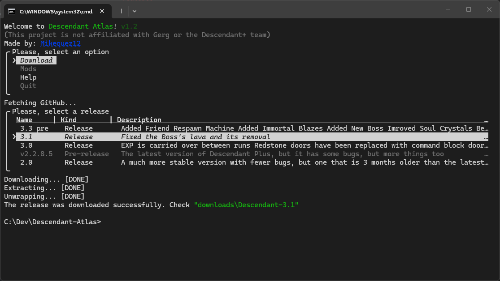

# Descendant Atlas
<sub>v1.9</sub>



**Descendant Atlas** is a command-line utility for creating, managing and applying mods for **Descendant+**.

Instead of manually copying datapacks, structures and resource packs between worlds, Descendant Atlas packages them into a portable `.dscmod` file that can later be applied to another installation.

## Why Atlas?

Descendant Atlas was created to make installing and modifying Descendant+ simpler.

While experienced users may already be familiar with GitHub releases, archive extraction and Minecraft's world structure, many players are not. Atlas automates those repetitive tasks so users can focus on playing and creating content instead of managing files.

Its goal is to provide a straightforward way to download official Descendant+ releases, create portable mods and apply them safely without manually navigating world folders.

Atlas also includes a lightweight Minecraft launcher capable of starting compatible installations without relying on the official launcher interface.

## What's New in v1.9

### Atlas-Extra (Early Access)

Atlas-Extra is now included as an experimental companion tool for Descendant Atlas.

Its first major feature is a cross-world progression system capable of transferring supported player progress between Descendant+ worlds. This includes progression such as unlocked content, loot crates, and other supported data.

To transfer your progress check out `USAGE.md`.

>[!INFO]
>Loading a save does not remove additional progress already present in the destination world. For example, unlocks that were not present in the old world will remain unlocked.

Atlas-Extra is currently in **Early Access** and may receive breaking changes in future updates.

### Mod dependencies

Atlas now supports declaring dependencies between `.dscmod` files.

When creating a mod, you can select other mods as dependencies and optionally provide a download URL for each one. Atlas verifies dependencies using **SHA-256 hashes**, allowing dependencies to be identified even when their filenames differ.

When importing a mod:

* Existing dependencies are detected automatically.
* Missing dependencies can be skipped, installed, or cause the import to be aborted.
* Dependencies installed during the import are automatically added to the import queue.
* Dependency chains are supported, allowing a dependency to have dependencies of its own.

### General improvements

* Improved the terminal interface.
* Added support for releases with multiple downloadable assets.
* Improved mod dependency handling.
* Added SHA-256 dependency verification.
* Various bug fixes and internal improvements.

> [!WARNING]
> After importing mods, open the modified world in Minecraft before importing additional mods. Atlas applies part of the installation when the world is first loaded, and importing another mod before that process has completed may corrupt the installation.

## About

Descendant Atlas is an independent utility built around Descendant+.

Atlas is **not** a fork of Descendant+, does not replace it and is not affiliated with its development team. Instead, it complements existing Descendant+ releases by providing tools for downloading, packaging and applying community-made modifications.

Atlas is built around three design principles:

- Preserve official Descendant+ releases whenever possible.
- Keep mods portable through the `.dscmod` format.
- Automate repetitive installation tasks without changing gameplay by itself.

Rather than altering existing game content, Atlas only adds or patches the minimum components required to manage and load Atlas mods.

## Features

- Atlas-Extra (Early Access) with cross-world progression transfer.
- Download official Descendant+ releases directly from GitHub.
- Create portable `.dscmod` mod packages.
- Import many mods at the same time.
- Apply mods into existing Descendant+ worlds.
- Merge resource packs into the world's `resources.zip`.
- Import structures automatically.
- Apply structure placement automatically on first world load.
- Preserve compatibility with existing datapacks.
- Launch Minecraft directly from Atlas (Beta).
- Built-in configuration editor.
- Automatic detection and graceful fallback for ANSI and Unicode terminals.
- Cross-platform support (Windows, Linux and macOS).

## Requirements

- Python 3.10 or later (when running from source)
- Git (optional, when cloning the repository)

## Installation

### Windows

#### Option 1 — Executable (Recommended)

Download the repository using **Code → Download ZIP**, extract it, then run `DescendantAtlas.exe`.

> [!IMPORTANT]
> Starting with v1.8, standalone `.exe` files are no longer published in GitHub Releases.
>
> Atlas expects to run from within its project directory, and distributing only the executable caused compatibility issues on some systems.
>
> If you prefer using the executable, download the project .zip from the release and run the bundled .exe from inside the extracted project folder.

> [!NOTE]
> Windows SmartScreen may display a warning because Atlas is not code-signed. If you trust the release, click **More info** → **Run anyway**.

#### Option 2 — From source

Install Python from [python.org](https://www.python.org/downloads/) if it isn't already installed.

```bat
git clone https://github.com/Mikequez12/descendant-atlas
cd descendant-atlas
python -m pip install -r requirements.txt
python main.py
```
### Linux

Ensure Python 3 is installed, then run:

```sh
git clone https://github.com/Mikequez12/descendant-atlas
cd descendant-atlas
python3 -m pip install -r requirements.txt
python3 main.py
```

### macOS

Ensure Python 3 is installed (Homebrew is recommended), then run:

```sh
git clone https://github.com/Mikequez12/descendant-atlas
cd descendant-atlas
python3 -m pip install -r requirements.txt
python3 main.py
```

## Usage
Check the [usage](./USAGE.md) file for detailed information on how to use Atlas and Atlas-Extra.

## FAQ

**Q: Does Atlas cause issues with Descendant+?**  
**A:** No known issues caused by Atlas itself have been reported so far. However, third-party mods or newly released versions of Descendant+ may introduce incompatibilities. If you find a bug that appears to be caused by Atlas, please report it by opening an issue on GitHub.

---

**Q: Does Atlas use real Minecraft mods?**  
**A:** No. Atlas uses `.dscmod` files, which package datapacks, resource packs, structures and other world modifications.

---

**Q: Does Atlas work on Linux?**  
**A:** Yes. Atlas is designed to be cross-platform and should work on Linux.

---

**Q: How does Atlas work?**  
**A:** Atlas downloads releases from the Descendant+ GitHub repository and applies modifications locally. If you're curious about the implementation, feel free to read the source code in `main.py`.

---

**Q: Is Atlas a virus?**  
**A:** No. Atlas is an open-source modding tool, not a virus or malware.
However, Atlas can download mod dependencies from URLs provided by their creators. A malicious mod author could therefore provide a malicious file. **Always check the download URL shown by Atlas before installing a dependency.**


---

**Q: Where can I find Atlas mods?**  
**A:** There is currently no official repository for Atlas mods. You'll need to obtain `.dscmod` files directly from their creators.

---

**Q: Why doesn't Atlas include modified Descendant+ releases?**  
**A:** Atlas intentionally distributes the official Descendant+ releases without altering their contents. Any changes introduced by Atlas are limited to the infrastructure required to load Atlas mods, helping keep releases as close as possible to the originals.

---

**Q: Why do I need to open the descendant world after modding it?**  
**A:** Atlas does not finish applying a mod entirely when the import operation completes. Some changes are applied by the descendant-atlas datapack when the world is first loaded. If you import another mod before loading the world, both installations may interact before Atlas has finalized the previous one, which can cause conflicts or corrupt the installation.
For this reason, always open the world once after importing mods before importing additional mods.

---

**Q: What is Atlas-Extra?**  
**A:** Atlas-Extra is an experimental framework included with Descendant Atlas. It provides developers with a simpler and more consistent way to interact with Descendant+ data while also introducing optional features for players, including a cross-world progression system capable of transferring achievements, unlocked classes, items and other supported data between worlds.

## Project structure

```
.mc/
atlas-extra/
downloads/
docs/
mods/
    .resourcepacks/
    *.dscmod
```

## Before you start
> [!CAUTION]
> This project is still experimental. Please make a backup before importing any files. Better safe than sorry.

> [!CAUTION]
> Installing multiple modpacks without loading the world in between will cause issues: After every installation you need to run the world to finish the installing process.
